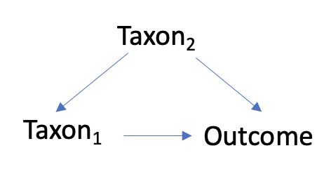

# Making differential abundance testing less naive...
Microbiome differential abundance testing is a very naive approach that doesn't consider feature-specific confounding and relationships between features within the dataset. Let's try to improve that.

  <!-- badges: start -->
  
  <!-- badges: end -->

## The problem
Many regressions run in differential abundance (DA) testing are confounded. The figure below shows an example directed acyclic graph (DAG), where one regression run in DA would be outcome ~ taxon1. The confounding effects of taxon2 could lead to a spurious association (or lack thereof) between the outcome and taxon1, which is one reason why differential abundance results cannot be interpreted as causal. Controlling this gives a less biased estimate of of the causal effect of taxon1 on the outcome.

3 main steps, as I see it currently:
1. Identification of directional interactions between features (e.g., microbes)
2. Identification of other features that also affect the outcome
3. Running differential abundance regression with confounding features (which affect both the microbe of interest and the outcome) included as covariates

One other approach - rather than statistically controlling, consider aggregating potential confounders that are members of the same functional guild. The way we think of gene pathways could be a good example of this. See the below DAG, where the transcription factor nuclear factor $\kappa$ B is a confounder via on the effects of IL-1 $\beta$ on some outcome. A common technique is to aggregate these into one pathway that is then discussed biologically.

